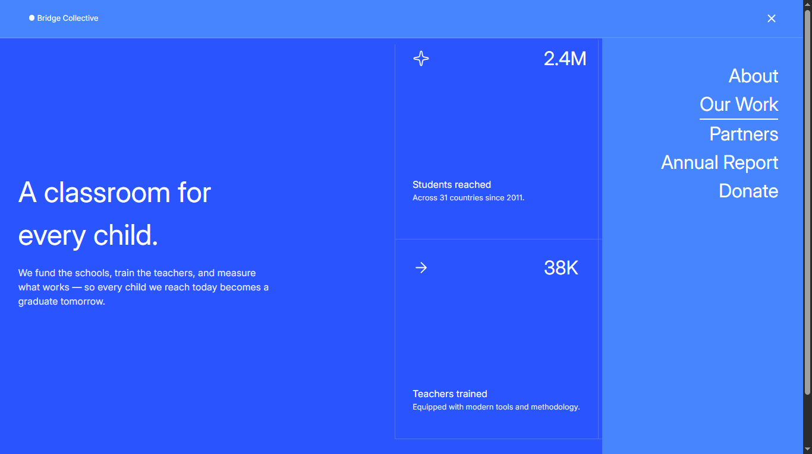

# 🏫 Grid Landing Page

  

A responsive landing page built with HTML and CSS as part of a Frontend Mentor challenge, featuring a CSS Grid-based layout and a responsive navigation menu without JavaScript.

## 📖 About the Challenge

This project is a solution to a Frontend Mentor challenge focused on building a responsive landing page with a structured grid layout, responsive navigation, and different layouts across screen sizes.

## ✨ Highlights

- 📱 Fully responsive layout for mobile and desktop.
- ☑️ CSS-only mobile navigation using the Checkbox Hack.
- 👀 Interactive state management using the `:checked` pseudo-class and `:has()` selector.
- 📐 Responsive layouts built with CSS Grid.
- 🔤 Custom local font loaded using `@font-face`.
- 🎨 Responsive navigation menu that transforms into a side panel on larger screens.
- 🧱 Semantic HTML structure.
- 📊 Structured content using the `<data>` element for numerical values.

## 🛠️ Built With

  

## 💡 Key Takeaways

Throughout this project, I:

- Learned how the CSS Checkbox Hack can be used to create interactive UI components without JavaScript.
- Learned how to use the `:has()` selector to style elements based on the state of another element.
- Strengthened my CSS Grid skills by creating complex responsive layouts and positioning elements across different rows and columns.
- Improved my understanding of responsive navigation and how the same menu can behave differently across screen sizes.
- Learned how to load and use local fonts with `@font-face`.
- Improved my problem-solving skills by breaking down a complex design into smaller layout and responsive challenges.
- Gained more confidence in building complete responsive landing pages using HTML and CSS.

## 🔗 Links

- 🌐 **Live Site:** https://frontend-mentor-grid-landing-page-seven.vercel.app/
- 💻 **Repository:** https://github.com/Ziad-mo205/Frontend-Mentor---Grid-Landing-Page.git
- 🎯 **Frontend Mentor Solution:** https://www.frontendmentor.io/solutions/responsive-landing-page-using-css-grid-8Oaq9xXFpS
